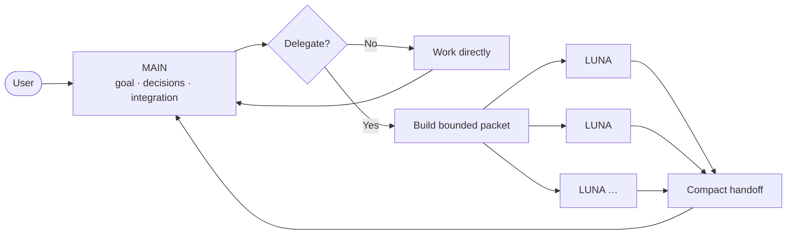

<div align="center">

# ⚡ AgentMaxxing

### Keep the main agent sharp. Push heavy work outward.

**Context-efficient delegation for Codex-style coding workflows.**

[](LICENSE)


[English](README.md) · [Türkçe](README_TR.md)

</div>

---

AgentMaxxing is a lightweight orchestration skill built around one rule:

> **The main agent keeps the goal, decisions, and integration context. Heavy bounded work goes to LUNA workers.**

Workers receive small, explicit task packets and return compact, verifiable results. AgentMaxxing does not maximize agent count; it minimizes duplicated context.

## Core model



There is no fixed worker limit. Use another worker only when its work is genuinely independent and the context saved is worth the coordination cost.

## Routing

| Work | Default route |
| --- | --- |
| Tiny or tightly coupled task | Main handles it directly |
| One heavy, bounded task | One LUNA worker |
| Independent heavy workstreams | Multiple LUNA workers |
| Sequential dependencies | Finish and condense the first result before starting the next |
| Security-sensitive or high-risk review | Add an independent reviewer only when justified |

Avoid overlapping write ownership, repeated repository discovery, and workers that receive the full conversation without a concrete need.

## Responsibilities

### Main agent

The main agent owns:

- user intent and constraints;
- architectural decisions;
- task decomposition and worker ownership;
- conflict detection;
- final integration and validation;
- the final answer.

### LUNA worker

A LUNA worker owns one bounded outcome. It should:

1. inspect only the required inputs;
2. complete the task within its scope;
3. run relevant validation;
4. self-review once and make a targeted correction if needed;
5. return a compact handoff.

Recommended profile when available:

```text
model: gpt-5.6-luna
reasoning: xhigh
```

## Worker packet

Before delegating, remove ambiguity. A useful packet looks like this:

```markdown
Role: LUNA worker

Goal:
<one concrete outcome>

Why delegated:
<heavy context or workload that should stay isolated>

Inputs:
- <exact files, directories, logs, commands, URLs, or artifacts>

Scope:
- May inspect: <...>
- May edit: <...>
- Must not edit: <...>

Suggested steps:
1. <first useful step>
2. <validation and self-review>

Constraints:
- <behavior, API, dependency, style, or permission boundary>

Done when:
- <measurable acceptance criterion>

Validation:
- <exact command or check>

Return only:
- status
- changed files
- 2–5 result bullets
- validation result
- material caveat or decision needed
```

See [worker packet guidance](.agents/skills/agentmaxxing/references/worker-packet.md) and [routing guidance](.agents/skills/agentmaxxing/references/routing.md) for edge cases.

## Compact handoff

Workers should return an integration index, not a transcript:

```text
STATUS: success | needs-input | failed

CHANGED:
- <paths or none>

RESULT:
- <2–5 concise bullets>

VALIDATION:
- PASS/FAIL/SKIPPED — <exact command or check>

CAVEAT / DECISION NEEDED:
- <only if material>
```

The main agent opens only the diffs or artifacts needed for integration.

## Installation

The repo-scoped skill lives at:

```text
.agents/skills/agentmaxxing/
```

Install it with the Codex skill installer or copy that directory into a supported skills location. Invoke it explicitly:

```text
$agentmaxxing <your repository task>
```

Implicit invocation is disabled so ordinary small tasks do not change workflow unexpectedly.

## Repository

```text
AgentMaxxing/
├── .agents/skills/agentmaxxing/
│   ├── SKILL.md
│   ├── agents/openai.yaml
│   └── references/
│       ├── routing.md
│       └── worker-packet.md
├── docs/ARCHITECTURE.md
├── AGENTS.md
├── CHANGELOG.md
├── README.md
└── README_TR.md
```

AgentMaxxing is an instruction layer, not a runtime. It has no daemon, database, telemetry service, token ledger, or persistent task registry.

## VisionOffload

VisionOffload is intentionally not included yet. It will be developed separately and can later reuse the same context-isolation principles.

## License

Apache License 2.0. AgentMaxxing is an independent open-source project and is not affiliated with or endorsed by OpenAI.
