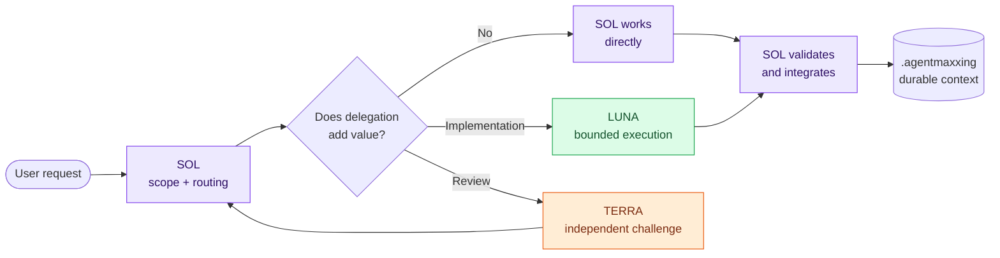
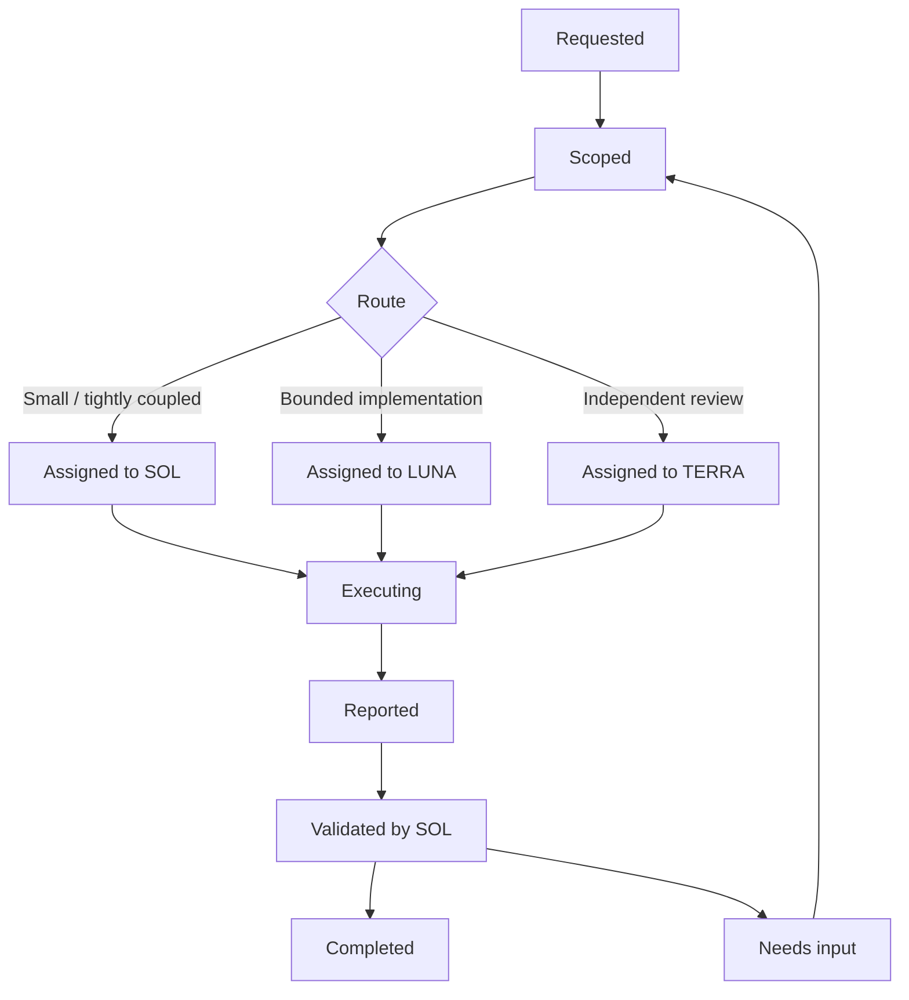

# AgentMaxxing

> **Cost-efficient multi-agent orchestration for Codex**
>
> Keep context small. Delegate with intent. Validate with evidence.

**Languages:** [English](README.md) · [Türkçe](README.tr.md)


[](LICENSE)
[](docs/architecture.md)

AgentMaxxing is an open workflow protocol for running AI coding work like a
small, focused team. A **SOL** agent keeps the goal and project state, then
routes only the work that genuinely benefits from **LUNA** or **TERRA**.

> **v0.1 status:** The repo-scoped Codex skill is ready. No runtime, CLI, or
> plugin is required.

## ✦ What problem does it solve?

Long AI coding sessions tend to accumulate repository dumps, vague tasks, stale
decisions, and unverified “done” claims. AgentMaxxing simplifies that workflow
with four explicit rules.

| Common problem | AgentMaxxing approach |
| --- | --- |
| Context grows until important information gets lost | Keep only **current state**, **durable decisions**, and the **active task** |
| Delegation goals are vague | Define a bounded **task envelope** with scope and acceptance criteria |
| Test claims lack evidence | Every `PASS` includes the exact command or check that produced it |
| Responsibility is split across agents | Delegation transfers work; **SOL keeps final ownership** |

## ◈ Architecture at a glance



### Three roles, three clear responsibilities

| Role | When it steps in | Boundary it protects |
| --- | --- | --- |
| **SOL** | At the start and end of every request | Goal, integration, and final quality |
| **LUNA** | For narrow, measurable implementation work | Only the assigned files and acceptance criteria |
| **TERRA** | For architecture challenges, uncertain root causes, or risk review | Analysis only unless separate authority is granted |

Role names describe stable responsibilities, not a permanent model lock. Model
and reasoning-level mappings can change with capability, cost, and measured
results.

## ⟳ Workflow



### The short version

1. **SOL selects context:** Start with `.agentmaxxing/state.md`; load the active
   task and architectural decisions only when needed.
2. **Classify the work:** Make scope, acceptance criteria, file ownership, and
   approval boundaries explicit.
3. **Choose the route:** Keep small work with SOL; send bounded implementation
   to LUNA and independent challenges to TERRA.
4. **Compress the handoff:** The specialist reports changes, outcomes, test
   evidence, and remaining work.
5. **SOL validates:** Treat the report as an index; inspect the actual files and
   rerun critical checks.
6. **Persist changed truth only:** Update durable context after validation.

## ▣ Small, durable context

```text
.agentmaxxing/
├── state.md              # Where are we now?
├── decisions.md          # What durable decisions have we made?
└── tasks/
    └── current.md        # The single active integration task
```

This directory is not a conversation archive. **SOL is the sole logical writer**;
specialists may only propose context updates in their reports. Raw reasoning
traces, full transcripts, and routine progress notes do not enter durable
context.

## ✉ What does a task handoff look like?

### 1. SOL → specialist: task envelope

```markdown
Role: LUNA
Goal: Reject expired refresh tokens before rotation.
Scope:
- src/auth/token.ts
- tests/auth/token.test.ts
Requirements:
- Cover valid and expired token scenarios.
Constraints:
- Preserve the public API and session storage behavior.
Acceptance:
- Targeted tests pass.
- Existing auth tests remain green.
```

### 2. Specialist → SOL: compressed result report

```markdown
Changed:
- src/auth/token.ts
- tests/auth/token.test.ts

Fixed:
- Expired refresh tokens are rejected before rotation.

Tests:
- PASS — npm test -- tests/auth/token.test.ts

Remaining:
- None

Decision needed:
- None
```

A task is ready to assign only when **Role**, **Goal**, **Scope**,
**Requirements**, **Constraints**, and **Acceptance** are known. This prevents
the specialist from rediscovering the entire repository.

## ⌁ Core invariants

| Principle | Practical consequence |
| --- | --- |
| **SOL remains accountable** | Delegation never transfers final ownership |
| **Context is selected** | Agents receive only sufficient files and constraints |
| **Scopes do not overlap** | Concurrent work has explicit file ownership |
| **Claims are verifiable** | A `PASS` report includes an exact command or check |
| **Roles are model-independent** | Responsibility contracts survive model changes |
| **Permissions do not expand** | A specialist never receives broader authority than SOL or the user |

## 🚀 Getting started

The reference implementation in this repository is the repo-scoped
[`$agentmaxxing` skill](.agents/skills/agentmaxxing/SKILL.md).

### Install as a personal skill

Use Codex's built-in installer so AgentMaxxing is available in every repository:

```text
$skill-installer install the agentmaxxing skill from https://github.com/HakanBabus/AgentMaxxing/tree/main/.agents/skills/agentmaxxing
```

Start a new Codex turn after installation. If the skill still does not appear,
restart Codex and invoke it explicitly with `$agentmaxxing`.

For repo-only use, keep or copy the skill folder at
`.agents/skills/agentmaxxing/` and launch Codex from that repository or one of
its subdirectories.

### Run it

Invoke it from Codex with a concrete repository task:

```text
$agentmaxxing implement the bounded task in .agentmaxxing/tasks/current.md
```

The skill:

- Loads project state selectively.
- Decides whether delegation adds enough value.
- Gives specialists small, measurable task envelopes.
- Validates handoffs against acceptance criteria.
- Lets SOL alone update durable context.
- Safely initializes and validates the three persistent context files.

The workflow remains a standalone skill; plugin packaging is intentionally out
of scope.

## ◫ Documentation map

| Document | Covers |
| --- | --- |
| [Architecture](docs/architecture.md) | Boundaries, components, invariants, and failure modes |
| [Task protocol](docs/task-protocol.md) | Task envelopes, result reports, and lifecycle contracts |
| [Agent workflow](docs/workflow.md) | Routing, execution, validation, and measurement |
| [Repo skill](.agents/skills/agentmaxxing/SKILL.md) | Operational instructions used by Codex |
| [Contributing](CONTRIBUTING.md) | Development and contribution workflow |
| [Security](SECURITY.md) | Private security reporting process |

## 🗺 Roadmap

```text
Phase 1  Foundation       ████████████████████  Complete
Phase 2  Core system      ░░░░░░░░░░░░░░░░░░░░  Planned
Phase 3  Routing          ░░░░░░░░░░░░░░░░░░░░  Planned
Phase 4  Optimization     ░░░░░░░░░░░░░░░░░░░░  Planned
```

- **Phase 1 — Foundation:** Repository structure, documentation, context
  templates, workflow contracts, and the v0.1 Codex skill. **Complete.**
- **Phase 2 — Core system:** Task manager, state manager, context loader, and
  machine-readable agent messages.
- **Phase 3 — Routing:** Evidence-based SOL/LUNA/TERRA selection and delegation
  rules.
- **Phase 4 — Optimization:** Token budgets, context compression, and routing
  evaluation.

Each phase is acceptance-driven. A new phase starts only after the previous
phase’s contracts have been exercised on representative tasks.

## 🤝 Contributing and boundaries

Phase 1 focuses on the protocol and its invariants. Before proposing an
automation layer, open a discussion explaining which manual failure it removes
and how it preserves the minimal-context design.

See [CONTRIBUTING.md](CONTRIBUTING.md) for the contribution workflow, the
[Code of Conduct](CODE_OF_CONDUCT.md) for community rules, and
[SECURITY.md](SECURITY.md) for security reports.

## License

Licensed under the [Apache License 2.0](LICENSE).

AgentMaxxing is an independent open-source project and is not affiliated with
or endorsed by OpenAI.
