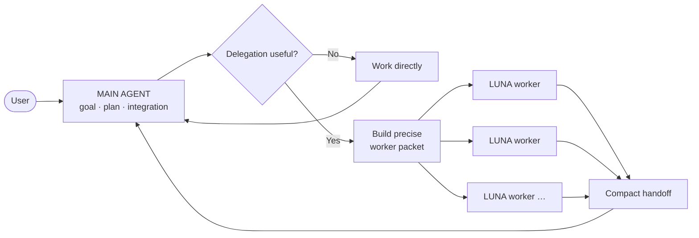
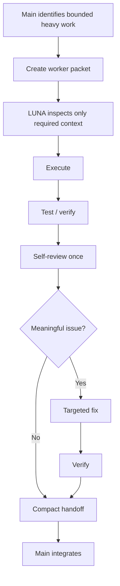

<div align="center">

# ⚡ AgentMaxxing

### Keep the main agent sharp. Push heavy work outward.

**Context-efficient delegation for Codex-style coding workflows.**

[](LICENSE)


[English](README.md) · [Türkçe](README_TR.md)

</div>

---

AgentMaxxing is a lightweight orchestration skill built around one idea:

> **The main agent should keep the goal, decisions, and integration context — not every log, file, exploration path, and intermediate detail.**

The main agent stays responsible for planning and final integration. Heavy or isolated work can be delegated to **LUNA workers** using small, explicit task packets. Workers return compact, verifiable handoffs instead of dumping their full context back into the main session.

AgentMaxxing does **not** try to maximize the number of agents. It tries to minimize duplicated context.

## ✦ The core model



There is **no arbitrary one-worker cap**. Open as many workers as the task genuinely benefits from — but only when their responsibilities are independent enough to avoid duplicated reading and conflicting edits.

The default bias is still conservative:

- tiny task → main handles it
- one heavy bounded task → one worker
- several independent heavy tasks → several workers
- tightly coupled tasks → keep sequential
- same files / same investigation duplicated across workers → avoid

## ◈ Why this exists

Long coding sessions often become expensive and fragile for a simple reason: too much material accumulates in the primary session.

Examples:

- giant logs
- broad repository exploration
- repeated test output
- large source files
- research dumps
- build failures
- several implementation branches
- verbose agent reports

AgentMaxxing treats the main context as a scarce resource.

| Without context discipline | With AgentMaxxing |
| --- | --- |
| Main reads everything | Main reads the minimum needed to route and integrate |
| Workers rediscover the project | Workers receive a scoped packet |
| Same task gets analyzed repeatedly | Ownership is explicit |
| Worker sends a long transcript back | Worker sends a compact result |
| Reviewer agent is opened by default | Worker self-checks first |
| Parallelism is used because it exists | Parallelism is used only when work is independent |

## 🧠 Roles

### MAIN — orchestrator

The main agent owns:

- user intent
- architecture-level decisions
- task decomposition
- worker selection
- conflict avoidance
- final integration
- final answer

The main agent should avoid loading heavy material that a worker can inspect independently.

### LUNA — isolated worker

LUNA is intentionally treated as an **execution worker, not a vague autonomous teammate**.

LUNA works best when the main agent gives it a precise packet containing:

1. **Goal** — one concrete outcome.
2. **Why this is delegated** — what heavy context should remain isolated.
3. **Inputs** — exact files, commands, logs, URLs, or directories that matter.
4. **Scope** — what it may change or inspect.
5. **Steps** — a short suggested path when the task is non-trivial.
6. **Constraints** — APIs, dependencies, behavior, style, or files that must remain untouched.
7. **Done when** — measurable acceptance criteria.
8. **Validation** — exact tests/checks when known.
9. **Return format** — compact handoff only.

Recommended worker profile when available:

```text
model: gpt-5.6-luna
reasoning: xhigh
```

The higher reasoning level compensates for the worker receiving less broad context. The main agent should improve the packet before adding more context.

## ✉ Worker packet

A good packet is intentionally boring and explicit:

```markdown
Role: LUNA worker

Goal:
Fix the stale profile request race condition.

Why delegated:
The worker can inspect the request lifecycle and test output without loading those details into the main session.

Inputs:
- src/profile/store.ts
- src/profile/api.ts
- tests/profile/store.test.ts

Scope:
- May edit the three files above.
- May inspect directly imported helpers if necessary.

Suggested steps:
1. Reproduce or identify the stale-response path.
2. Make the smallest safe fix.
3. Add or adjust the focused regression test.
4. Run the targeted tests.
5. Self-review the diff once.

Constraints:
- Do not change the public profile API.
- Do not add dependencies.
- Do not refactor unrelated state code.

Done when:
- Older requests cannot overwrite newer profile state.
- Existing profile tests still pass.

Validation:
- npm test -- tests/profile/store.test.ts

Return only:
- status
- changed files
- 2–5 bullet summary
- validation result
- important caveat / decision needed, if any
```

The point is not to make packets huge. The point is to remove ambiguity **before** handing the task to a cheaper worker.

## ↩ Compact handoff

Workers should not return their whole thought process, raw logs, or every file they opened.

Preferred handoff:

```text
STATUS: success

CHANGED:
- src/profile/store.ts
- tests/profile/store.test.ts

RESULT:
- stale requests can no longer replace newer profile state
- regression coverage added for out-of-order responses

VALIDATION:
- PASS — npm test -- tests/profile/store.test.ts

CAVEAT:
- none
```

The main agent can open a diff or targeted artifact only when integration actually requires it.

## ⇄ Worker lifecycle



A separate reviewer worker is **not** the default. The worker that implements a bounded task should test and self-review it first.

Use another worker for review only when independent evaluation has real value: security-sensitive changes, consequential architecture, suspicious failures, or explicit user request.

## ⫶ Multiple workers without context explosion

Parallel workers are useful only when their work is genuinely separable.

### Good

```text
Worker A → inspect failing auth tests
Worker B → migrate unrelated settings UI
Worker C → research an external API compatibility question
```

### Bad

```text
Worker A → inspect auth system
Worker B → inspect auth system again
Worker C → review Worker A before Worker A even validates its own work
```

Rules:

- Do not assign overlapping write ownership at the same time.
- Do not duplicate repository exploration without a reason.
- Prefer sequential handoff when task B depends on task A.
- Reuse an existing worker when continuing the exact same bounded task and the environment supports it.
- Start a fresh worker for a new independent task so old context does not grow forever.

## 🧱 Context firewall

Think of AgentMaxxing as a context firewall:

```text
heavy source / logs / tests / research
                │
                ▼
          isolated LUNA
                │
        compact verified result
                │
                ▼
             MAIN
```

Main context should normally contain:

- the user's goal
- high-level project constraints
- the current plan
- task ownership
- compact worker results
- relevant diffs or artifacts needed for integration

It should normally avoid:

- full worker transcripts
- raw test floods
- giant log files
- entire repository dumps
- repeated copies of the same source files
- unrelated investigation trails

## 🚀 Installation

The repo-scoped skill lives at:

```text
.agents/skills/agentmaxxing/
```

Install it with the Codex skill installer when supported, or copy the skill directory into a repository's `.agents/skills/` folder.

Invoke explicitly:

```text
$agentmaxxing <your repository task>
```

AgentMaxxing intentionally uses explicit invocation so ordinary small tasks do not spawn workers or change workflow unexpectedly.

## 📁 Repository

```text
AgentMaxxing/
├── .agents/
│   └── skills/
│       └── agentmaxxing/
│           ├── SKILL.md
│           ├── agents/
│           │   └── openai.yaml
│           └── references/
│               ├── routing.md
│               └── worker-packet.md
├── docs/
│   └── ARCHITECTURE.md
├── AGENTS.md
├── CHANGELOG.md
├── CONTRIBUTING.md
├── LICENSE
├── README.md
└── README_TR.md
```

No runtime. No daemon. No database. No token accounting service. No persistent task registry.

The product is the orchestration behavior.

## 🖼 VisionOffload

Visual offloading is intentionally **not included in this revision**.

VisionOffload will be developed separately first, then its visual-context isolation rules can be integrated into AgentMaxxing without changing the core worker model.

## Roadmap

- [x] Context-first redesign
- [x] LUNA-only worker model
- [x] Explicit worker packet contract
- [x] Dynamic worker count based on task independence
- [x] Compact handoffs and worker self-review
- [ ] VisionOffload integration
- [ ] Real-world usage tuning

## License

Apache License 2.0.

AgentMaxxing is an independent open-source project and is not affiliated with or endorsed by OpenAI.
