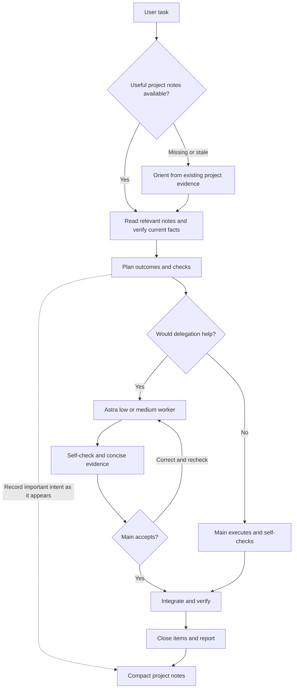

<div align="center">

# ⚡ AgentMaxxing

**Focused execution. Useful delegation. Project intent that lasts.**

A lightweight Codex skill for **single-agent work**, optional **Astra low/medium workers**, and **compact project memory**.

[](LICENSE)


[English](README.md) · [Türkçe](README_TR.md)

[Start here](#start-here) · [Workflow](#the-workflow) · [First use](#joining-a-project-midway) · [Workers](#choosing-workers) · [Memory](#small-memory-full-intent)

</div>

---

> **Keep the work focused and the decisions durable.** Use one agent by default, delegate a bounded task when it adds value, and record future work before it disappears into chat history.

| Execution | Workers | Continuity |
| --- | --- | --- |
| **One integration owner** | **Astra low or medium** | **Small, sourced Markdown notes** |
| Plan stages without automatically spawning agents | Match effort to task scope; medium is the ceiling | Keep intent, conditions, and evidence across sessions |

## Start here

Install the skill by asking Codex:

```text
Use $skill-installer to install the skill at:
https://github.com/HakanBabus/AgentMaxxing/tree/main/.agents/skills/agentmaxxing
```

You can also copy `.agents/skills/agentmaxxing/` into a supported skills location, or use the repo-scoped copy. The skill includes its references; project memory stays inside the project you are working on.

Then invoke it explicitly:

```text
$agentmaxxing Fix the save/reload bug. Keep the change scoped and verify it.
```

Already halfway through a project? Use the same invocation. **No existing AgentMaxxing notes are required.** The skill first orients from your current files and documents.

The main session keeps the model and reasoning effort you selected. Optional workers use `gpt-6-astra` with `low` or `medium`. Automatic skill invocation remains disabled. See the [official skills guide](https://learn.chatgpt.com/docs/build-skills) for local discovery and invocation behavior.

## The workflow


```mermaid
flowchart TD
    A[User task] --> B{Useful project notes available?}
    B -->|Yes| C[Read relevant notes and verify current facts]
    B -->|Missing or stale| D[Orient from existing project evidence]
    D --> C
    C --> E[Plan outcomes and checks]
    E --> F{Would delegation help?}
    F -->|No| G[Main executes and self-checks]
    F -->|Yes| H[Astra low or medium worker]
    H --> I[Self-check and concise evidence]
    I --> J{Main accepts?}
    J -->|Correct and recheck| H
    J -->|Yes| K[Integrate and verify]
    G --> K
    K --> L[Close items and report]
    E -. Record important intent as it appears .-> M[Compact project notes]
    L --> M
```

| Step | What changes |
| --- | --- |
| **Orient** | Understand the existing project and the requested scope |
| **Execute** | Work directly, or isolate a useful independent task |
| **Verify** | Self-review, validate, and accept evidence before dependent work |
| **Remember** | Capture decisions during work; close or defer items at completion |

A large task can stay with one agent across several milestones. Delegation is a separate decision. Main owns integration and shared memory writes throughout.

## Joining a project midway

**Missing memory triggers orientation, not a project restart.** AgentMaxxing reads applicable instructions, the overview/README, relevant manifests or entrypoints, existing plans, and current work status. It expands into source only when the task needs more evidence.

| Found in the project | How it is treated |
| --- | --- |
| Existing roadmap or release checklist | Keep it authoritative and link it |
| Uncommitted changes | Preserve them as work in progress; completion is unverified |
| Old TODOs or plans | Retain their source and mark status unverified until checked |
| Missing history or release target | Leave it unknown; do not invent a timeline or version |
| Partial or stale notes | Fill relevant gaps and reconcile current facts incrementally |
| Read-only request | Return proposed notes without creating or changing files |

The first overview is **short and evidence-based**. Roadmap, release, and history files appear only when there is useful information to store. Git is useful when present, but a non-Git project can use its existing files and documents. In a monorepo, the component scope stays explicit.

For example, an existing editor with unfinished save changes is still an in-progress editor. A request to add export later becomes a future note; it does not authorize implementing export now. Unknown background should not block a well-scoped current fix.

Read the [first-use protocol](.agents/skills/agentmaxxing/references/project-memory.md#first-use-in-an-existing-project).

## Choosing workers

**Small does not mean mandatory delegation.** A low worker is useful when a clear task can progress independently or isolate noisy context. Direct execution stays preferable when the main agent already has the needed context.

| Route | Good fit | Example |
| --- | --- | --- |
| **Main** | Existing context or tightly coupled decisions | A local fix already understood by main |
| **Astra low** | Small scope, stable inputs, direct validation | A focused search, docs edit, or known-reproduction fix |
| **Astra medium** | Broader bounded work or interacting requirements | Cross-file diagnosis or one migration step |
| **Read-only reviewer** | Concrete risk or an evidence gap | Verify recovery behavior across accepted stages |

- Set **`gpt-6-astra`** and **`low` or `medium`** explicitly in supported spawn controls.
- **Medium is the ceiling**, including research, reviewers, and correction attempts.
- When low struggles, improve the packet and use medium if justified. When medium struggles, narrow the task, improve evidence, or return the coupled decision to main.
- Worker count follows genuine independence and client limits. Concurrent writers need non-overlapping scope; main writes shared memory.
- If the profile is unavailable, main can continue directly when feasible and disclose the limitation. Do not silently choose another worker model.

Astra supports these effort levels in its [official model documentation](https://developers.openai.com/api/docs/models/gpt-6-astra). The routing policy is this project's choice. The goal is less wasted context and coordination; no universal cost or quality saving is promised.

## Small memory, full intent

**Keep the note short; keep the meaning intact.** Reuse existing project documents before creating these files:

```text
.agentmaxxing/
├── project.md   Current direction, constraints, and source links
├── roadmap.md   Future shape, ideas, accepted work, and deferrals
├── release.md   Release checks, compatibility conditions, and evidence
└── history.md   Meaningful milestones and decision rationale
```

Create only useful files. The overview is an index, not a duplicate of the entire architecture. Read relevant sections on demand rather than loading the full history on every task.

A compact record can carry the important information in one entry:

```text
R-07 [deferred] Offline export | after storage v2 validation
Source: 2026-10-02, user request | Check: exported data survives reload
```

| Preserve | Keep compact by |
| --- | --- |
| Outcome, status, and who requested it | One sourced entry instead of repeated paragraphs |
| Constraints, dependencies, and meaningful rationale | Short conditions plus links to exact details |
| Open questions and release obligations | Explicit unresolved items and evidence-based checkboxes |
| Important older detail | Linked archives when needed, with a useful index |

**Capture in the same turn:** "later," "before release," and "defer until" requests should become durable notes while the agent is working. Suggestions remain `idea`; accepted or deferred work keeps its conditions. Do not drop unique information to satisfy an arbitrary length target.

**Resume from evidence:** verify mutable facts, update superseded notes, and preserve user intent. A missing or stale note is repaired incrementally rather than treated as a reason to guess or stop.

**Check before release:** readiness requires actual validation. Failed or unavailable checks stay visible. Memory capture runs during active work; there is no background service or guaranteed capture after an abrupt interruption.

See the [memory protocol](.agents/skills/agentmaxxing/references/project-memory.md) and [this repository's compact notes](.agentmaxxing/project.md).

## Evidence and corrections

Workers receive a small packet: **model/effort, outcome, reason for delegation, exact inputs, write scope, dependencies, acceptance, and validation**. They test and self-review before returning `ready-for-review`.

Main reviews only what it needs to decide **ACCEPT** or **REJECT**. Dependent work waits for acceptance. A correction can stay with the worker or move to main after an explicit transfer of write ownership; both routes require rechecking.

<details>
<summary><strong>Compact handoff format</strong></summary>

```text
STATUS: ready-for-review | needs-input | failed
CHANGED: <paths or none>
RESULT: <concise outcome>
ACCEPTANCE: <criterion IDs, PASS/FAIL, evidence>
VALIDATION: <PASS/FAIL/SKIPPED, exact check>
SELF-REVIEW: <material correction or none>
MEMORY NOTES: <durable notes for main, or none>
CAVEAT: <only if material>
```

Return evidence and navigation pointers, keeping raw logs and full transcripts outside the main context. See [low/medium packet examples](.agents/skills/agentmaxxing/references/worker-packet.md).

</details>

## Skill layout

```text
.agents/skills/agentmaxxing/
├── SKILL.md
├── agents/openai.yaml
└── references/
    ├── routing.md
    ├── worker-packet.md
    └── project-memory.md
```

| Document | Read it for |
| --- | --- |
| [Skill](.agents/skills/agentmaxxing/SKILL.md) | Operational instructions |
| [Routing](.agents/skills/agentmaxxing/references/routing.md) | Effort, concurrency, reviewers, and corrections |
| [Worker packets](.agents/skills/agentmaxxing/references/worker-packet.md) | Bounded task examples |
| [Project memory](.agents/skills/agentmaxxing/references/project-memory.md) | First use, compact capture, resume, and release |
| [Architecture](docs/ARCHITECTURE.md) | Roles, lifecycle, and failure handling |
| [Changelog](CHANGELOG.md) · [Contributing](CONTRIBUTING.md) | Changes and contribution scope |

## Scope and license

AgentMaxxing stays an instruction layer with a few project-local Markdown notes. It adds no database, daemon, dashboard, telemetry, token ledger, or worker registry. It keeps the main session's settings and the user's authorization boundaries. VisionOffload remains outside this revision.

[Apache License 2.0](LICENSE). Independent open-source project; not affiliated with or endorsed by OpenAI.
