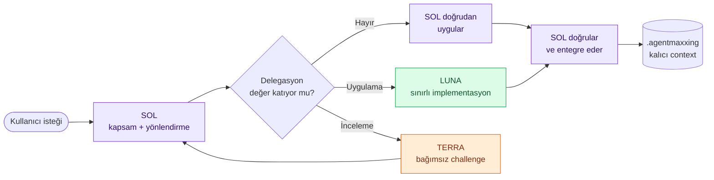
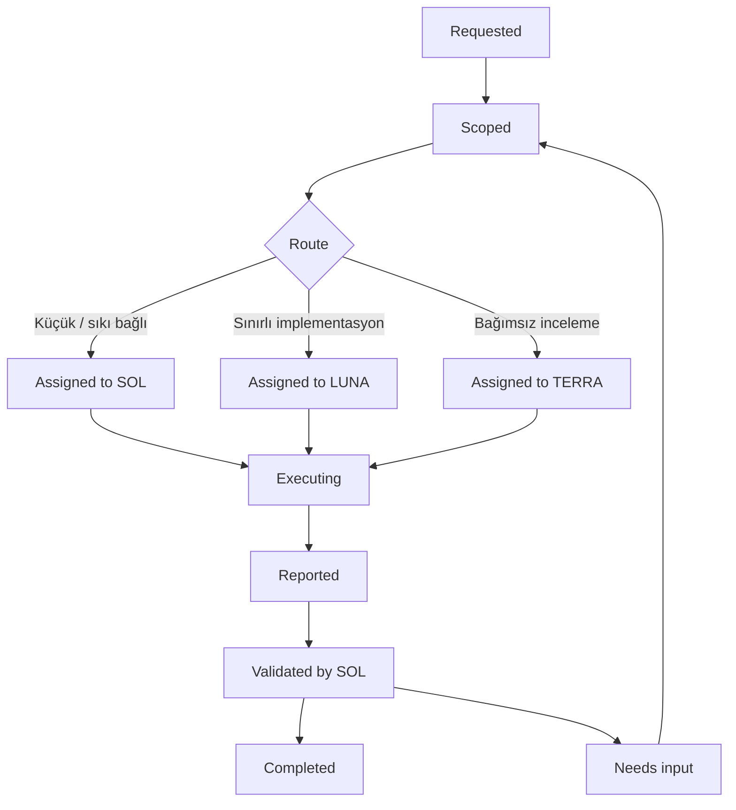

# AgentMaxxing

> **Codex için maliyet verimli çok ajanlı orkestrasyon**
>
> Bağlamı küçük tut. Bilinçli delege et. Kanıtla doğrula.

**Diller:** [English](README.md) · [Türkçe](README.tr.md)


[](LICENSE)
[](docs/architecture.md)

AgentMaxxing, AI coding çalışmalarını küçük ve odaklı bir ekip gibi yürütmek
için tasarlanmış açık bir workflow protokolüdür. Bir **SOL** ajanı hedefi ve
proje durumunu korur; yalnızca gerçekten fayda sağlayan işleri **LUNA** ve
**TERRA** uzmanlarına yönlendirir.

> **v0.1 durumu:** Repo-scoped Codex skill hazırdır. Runtime, CLI veya plugin
> gerektirmez.

## ✦ Neyi çözer?

Uzun AI coding oturumlarında aynı problemler tekrar eder: gereksiz repository
dump'ları, belirsiz görevler, bayat kararlar ve doğrulanmamış “tamamlandı”
iddiaları. AgentMaxxing bu akışı dört net kuralla sadeleştirir.

| Sık görülen sorun | AgentMaxxing yaklaşımı |
| --- | --- |
| Bağlam büyür, önemli bilgi kaybolur | Yalnızca **güncel durum**, **kalıcı kararlar** ve **aktif görev** saklanır |
| Delegasyon hedefi belirsizdir | Her iş için kapsamı ve başarı ölçütleri belli bir **task envelope** hazırlanır |
| Test iddiaları kanıtsız kalır | Her `PASS`, çalıştırılan kesin komut veya kontrol ile raporlanır |
| Sorumluluk ajanlar arasında dağılır | Delegasyon işi aktarır; **son sahiplik SOL’da kalır** |

## ◈ Bir bakışta mimari



### Üç rol, üç net sorumluluk

| Rol | Ne zaman devreye girer? | Koruduğu sınır |
| --- | --- | --- |
| **SOL** | Her isteğin başında ve sonunda | Hedef, entegrasyon ve nihai kalite |
| **LUNA** | Kapsamı dar, implementasyonu ölçülebilir işlerde | Yalnızca verilen dosya ve acceptance kriterleri |
| **TERRA** | Mimari meydan okuma, belirsiz root-cause veya risk incelemesinde | Analiz yapar; ayrı yetki verilmedikçe dosya değiştirmez |

Rol isimleri kalıcı sorumlulukları ifade eder; belirli bir model adına kilitli
değildir. Model ve reasoning seviyesi, yetenek, maliyet ve ölçülen sonuçlara göre
değiştirilebilir.

## ⟳ İş akışı



### Akışın kısa versiyonu

1. **SOL bağlamı seçer:** Önce `.agentmaxxing/state.md`, gerekiyorsa aktif görev
   ve mimari kararlar okunur.
2. **İş sınıflandırılır:** Kapsam, kabul ölçütleri, dosya sahipliği ve onay
   sınırları netleştirilir.
3. **Doğru rota seçilir:** Küçük işler SOL’da kalır; bounded implementation
   LUNA’ya, bağımsız challenge TERRA’ya gider.
4. **Handoff sıkıştırılır:** Uzman yalnızca değişiklik, sonuç, test kanıtı ve
   kalan işleri raporlar.
5. **SOL doğrular:** Rapor özet olarak kabul edilir; gerçek dosyalar ve kritik
   kontroller yeniden incelenir.
6. **Yalnızca değişen gerçek saklanır:** Kalıcı context, doğrulama sonrasında
   güncellenir.

## ▣ Küçük ama kalıcı context

```text
.agentmaxxing/
├── state.md              # Şu an neredeyiz?
├── decisions.md          # Neyi kalıcı olarak kararlaştırdık?
└── tasks/
    └── current.md        # Şu anki tek entegrasyon görevi
```

Bu klasör bir konuşma arşivi değildir. **SOL tek mantıksal yazardır**; uzmanlar
yalnızca raporlarında context güncellemesi önerebilir. Ham reasoning trace'leri,
tam transcript'ler ve rutin ilerleme notları kalıcı context'e yazılmaz.

## ✉ Görev handoff'u nasıl görünür?

### 1. SOL → uzman: task envelope

```markdown
Role: LUNA
Goal: Süresi dolmuş refresh token'ları rotation öncesinde reddet.
Scope:
- src/auth/token.ts
- tests/auth/token.test.ts
Requirements:
- Geçerli ve süresi dolmuş token senaryolarını kapsa.
Constraints:
- Public API ve session storage davranışını koru.
Acceptance:
- Hedef testler geçsin.
- Mevcut auth testleri yeşil kalsın.
```

### 2. Uzman → SOL: sıkıştırılmış result report

```markdown
Changed:
- src/auth/token.ts
- tests/auth/token.test.ts

Fixed:
- Süresi dolmuş refresh token'lar rotation öncesinde reddediliyor.

Tests:
- PASS — npm test -- tests/auth/token.test.ts

Remaining:
- None

Decision needed:
- None
```

Bir görev ancak **Role**, **Goal**, **Scope**, **Requirements**, **Constraints**
ve **Acceptance** alanları biliniyorsa atanır. Böylece uzman, tüm repository’yi
yeniden keşfetmek zorunda kalmaz.

## ⌁ Temel invariants

| İlke | Pratik sonucu |
| --- | --- |
| **SOL remains accountable** | Delegasyon final sahipliği devretmez |
| **Context is selected** | Ajanlara yalnızca yeterli dosya ve kısıt verilir |
| **Scopes do not overlap** | Aynı dosyada eşzamanlı ve belirsiz sahiplik oluşmaz |
| **Claims are verifiable** | `PASS` raporu kesin komut veya check içerir |
| **Roles are model-independent** | Model değişse de sorumluluk sözleşmesi korunur |
| **Permissions do not expand** | Uzman, SOL’dan veya kullanıcıdan daha geniş yetkiye sahip olmaz |

## 🚀 Başlangıç

Bu repository’de kullanılabilir referans uygulama, repo-scoped
[`$agentmaxxing` skill’idir](.agents/skills/agentmaxxing/SKILL.md).

Codex içinde somut bir repository göreviyle çağırın:

```text
$agentmaxxing .agentmaxxing/tasks/current.md içindeki bounded görevi uygula
```

Skill şu davranışları destekler:

- Proje durumunu seçerek yükler.
- Delegasyonun gerçekten değer katıp katmadığını değerlendirir.
- Uzmanlara küçük ve ölçülebilir task envelope’lar gönderir.
- Handoff’ları acceptance kriterlerine karşı doğrular.
- Kalıcı context’i yalnızca SOL’un güncellemesine izin verir.

Başka bir repository’de kullanmak için `agentmaxxing` skill klasörünü o
repository’nin `.agents/skills/` dizinine kopyalayın. Workflow bağımsız bir skill
olarak kalır; plugin paketlemesi bilerek kapsam dışındadır.

## ◫ Dokümantasyon haritası

| Belge | İçerik |
| --- | --- |
| [Architecture](docs/architecture.md) | Sınırlar, bileşenler, invariants ve failure modes |
| [Task protocol](docs/task-protocol.md) | Task envelope, result report ve lifecycle sözleşmesi |
| [Agent workflow](docs/workflow.md) | Routing, execution, validation ve ölçüm yaklaşımı |
| [Repo skill](.agents/skills/agentmaxxing/SKILL.md) | Codex’in uyguladığı operasyonel talimatlar |
| [Contributing](CONTRIBUTING.md) | Geliştirme ve katkı akışı |
| [Security](SECURITY.md) | Güvenlik bildirim süreci |

## 🗺 Roadmap

```text
Phase 1  Foundation       ████████████████████  Complete
Phase 2  Core system      ░░░░░░░░░░░░░░░░░░░░  Planned
Phase 3  Routing          ░░░░░░░░░░░░░░░░░░░░  Planned
Phase 4  Optimization     ░░░░░░░░░░░░░░░░░░░░  Planned
```

- **Phase 1 — Foundation:** Repository yapısı, dokümanlar, context şablonları,
  workflow sözleşmeleri ve v0.1 Codex skill’i. **Tamamlandı.**
- **Phase 2 — Core system:** Task manager, state manager, context loader ve
  machine-readable agent mesajları.
- **Phase 3 — Routing:** Evidence-based SOL/LUNA/TERRA seçimi ve delegasyon
  kuralları.
- **Phase 4 — Optimization:** Token bütçeleri, context compression ve routing
  değerlendirmesi.

Her faz acceptance-driven ilerler. Yeni faz, önceki fazın sözleşmeleri temsili
görevlerle sınanmadan başlamaz.

## 🤝 Katkı ve sınırlar

Phase 1 odağı protocol ve invariants’tır. Bir automation layer önermeden önce,
hangi manuel hatayı ortadan kaldırdığını ve minimal-context tasarımını nasıl
koruduğunu açıklayan bir discussion açın.

Katkı süreci için [CONTRIBUTING.md](CONTRIBUTING.md), topluluk kuralları için
[Code of Conduct](CODE_OF_CONDUCT.md) ve güvenlik bildirimleri için
[SECURITY.md](SECURITY.md) dosyasına bakın.

## Lisans

[Apache License 2.0](LICENSE) ile lisanslanmıştır.

AgentMaxxing bağımsız bir açık kaynak projesidir; OpenAI ile bağlantılı veya
OpenAI tarafından onaylanmış değildir.
