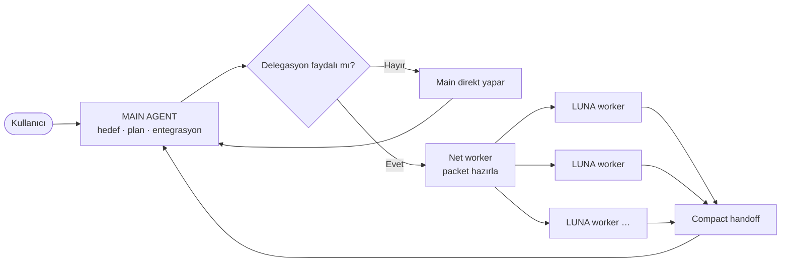
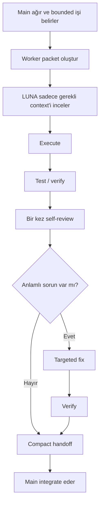

<div align="center">

# ⚡ AgentMaxxing

### Ana ajanı keskin tut. Ağır işi dışarı taşı.

**Codex tarzı coding akışları için context-verimli delegasyon.**

[](LICENSE)


[English](README.md) · [Türkçe](README_TR.md)

</div>

---

AgentMaxxing tek bir fikir etrafında kurulmuş hafif bir orchestration skill'idir:

> **Ana ajan hedefi, kararları ve entegrasyon context'ini taşımalı; her logu, dosyayı, araştırma yolunu ve ara çıktıyı değil.**

Ana ajan planlama ve final entegrasyondan sorumlu kalır. Ağır veya izole edilebilir işler, küçük ve açık task packet'ları ile **LUNA worker**'lara aktarılır. Worker'lar bütün context'lerini geri dökmek yerine kısa ve doğrulanabilir handoff verir.

AgentMaxxing'in amacı mümkün olduğunca çok ajan açmak değil, **aynı context'in gereksiz yere kopyalanmasını azaltmaktır.**

## ✦ Ana model



**Yapay bir tek-worker limiti yoktur.** İş gerçekten fayda görüyorsa gerektiği kadar worker açılabilir; fakat sorumluluklar yeterince bağımsız olmalı ki aynı dosyalar tekrar tekrar okunmasın ve worker'lar birbirinin işine girmesin.

Varsayılan eğilim yine tutumludur:

- minicik iş → main yapar
- tek ağır ve sınırları belli iş → tek worker
- birkaç bağımsız ağır iş → birkaç worker
- birbirine sıkı bağlı işler → sırayla ilerle
- aynı dosyaları / aynı araştırmayı birkaç worker'a tekrar yaptırma → kaçın

## ◈ Neyi çözüyor?

Uzun coding oturumları çoğu zaman basit bir nedenle ağırlaşır: ana oturumda gereğinden fazla materyal birikir.

Örnekler:

- dev loglar
- geniş repo keşfi
- tekrarlanan test çıktıları
- büyük source dosyaları
- araştırma dump'ları
- build hataları
- farklı implementasyon dalları
- uzun agent raporları

AgentMaxxing ana context'i kıt bir kaynak gibi ele alır.

| Context disiplini yok | AgentMaxxing |
| --- | --- |
| Main her şeyi okur | Main sadece route ve entegrasyon için gerekeni okur |
| Worker projeyi baştan keşfeder | Worker'a scoped packet verilir |
| Aynı iş tekrar tekrar analiz edilir | Ownership net verilir |
| Worker uzun transcript döner | Worker compact sonuç döner |
| Default reviewer agent açılır | Önce worker kendi işini kontrol eder |
| Paralellik var diye kullanılır | Sadece bağımsız işlerde kullanılır |

## 🧠 Roller

### MAIN — orchestrator

Main şunların sahibidir:

- kullanıcı amacı
- mimari seviyedeki kararlar
- task decomposition
- worker seçimi
- çakışma önleme
- final entegrasyon
- final cevap

Bir worker'ın bağımsız inceleyebileceği ağır materyali main mümkün olduğunca kendi context'ine taşımamalıdır.

### LUNA — izole worker

LUNA'yı **belirsiz bir otonom takım arkadaşı gibi değil, iyi yönlendirilmesi gereken execution worker** olarak ele alıyoruz.

LUNA'ya verilen iş paketi mümkün olduğunca şunları içermeli:

1. **Goal** — tek ve somut sonuç.
2. **Why delegated** — hangi ağır context worker'da kalmalı.
3. **Inputs** — önemli dosya, komut, log, URL veya klasörler.
4. **Scope** — neyi inceleyebilir/değiştirebilir.
5. **Steps** — iş zorsa kısa bir önerilen yol.
6. **Constraints** — bozulmaması gereken API, dependency, davranış, stil veya dosyalar.
7. **Done when** — ölçülebilir bitiş kriteri.
8. **Validation** — biliniyorsa tam test/check komutları.
9. **Return format** — sadece compact handoff.

Mümkün olduğunda önerilen worker profili:

```text
model: gpt-5.6-luna
reasoning: xhigh
```

Worker daha az geniş context aldığı için yüksek reasoning seviyesi faydalı olabilir. Sorun çıktığında ilk çözüm daha fazla context dökmek değil, **task packet'ı iyileştirmek** olmalıdır.

## ✉ Worker packet

İyi packet sıkıcı derecede net olmalıdır:

```markdown
Role: LUNA worker

Goal:
Stale profile request race condition'ını düzelt.

Why delegated:
Request lifecycle ve test çıktısı worker'da incelensin; detaylar main context'e taşınmasın.

Inputs:
- src/profile/store.ts
- src/profile/api.ts
- tests/profile/store.test.ts

Scope:
- Yukarıdaki üç dosyayı değiştirebilir.
- Gerekirse direkt import edilen helper'ları inceleyebilir.

Suggested steps:
1. Stale response yolunu bul/reproduce et.
2. En küçük güvenli fix'i yap.
3. Focused regression test ekle/düzelt.
4. Targeted testleri çalıştır.
5. Diff'i bir kez self-review et.

Constraints:
- Public profile API değişmeyecek.
- Yeni dependency eklenmeyecek.
- İlgisiz state kodu refactor edilmeyecek.

Done when:
- Eski request yeni profile state'i ezemiyor.
- Mevcut profile testleri geçiyor.

Validation:
- npm test -- tests/profile/store.test.ts

Return only:
- status
- changed files
- 2–5 maddelik özet
- validation sonucu
- varsa önemli caveat / decision needed
```

Amaç packet'ları dev hale getirmek değil. Amaç, daha ucuz worker'a işi vermeden önce **belirsizliği main'de çözmek**.

## ↩ Compact handoff

Worker bütün düşünce sürecini, raw logları veya açtığı her dosyayı geri yollamamalı.

Tercih edilen çıktı:

```text
STATUS: success

CHANGED:
- src/profile/store.ts
- tests/profile/store.test.ts

RESULT:
- stale request artık yeni profile state'i ezemiyor
- out-of-order response regression testi eklendi

VALIDATION:
- PASS — npm test -- tests/profile/store.test.ts

CAVEAT:
- none
```

Main sadece entegrasyon gerçekten gerektiriyorsa diff veya hedef artefact açar.

## ⇄ Worker lifecycle



Ayrı reviewer worker **default değildir**. Bounded işi yapan worker önce kendi işini test edip kontrol etmelidir.

Bağımsız review ancak gerçekten değerliyse açılır: güvenlik hassas değişiklik, önemli mimari karar, şüpheli failure veya kullanıcı açıkça isterse.

## ⫶ Context'i patlatmadan çok worker

Paralel worker yalnızca işler gerçekten ayrılabiliyorsa faydalıdır.

### İyi

```text
Worker A → failing auth testlerini incele
Worker B → bağımsız settings UI migration yap
Worker C → external API compatibility araştır
```

### Kötü

```text
Worker A → auth sistemini incele
Worker B → auth sistemini tekrar incele
Worker C → Worker A kendi testini bitirmeden onu review et
```

Kurallar:

- Aynı anda overlapping write ownership verme.
- Sebepsiz repo keşfi tekrarına izin verme.
- Task B, task A'ya bağlıysa sequential ilerle.
- Aynı bounded task devam ediyorsa ve ortam destekliyorsa aynı worker'ı resume et.
- Yeni bağımsız task için fresh worker aç; eski worker context'i sonsuza kadar büyümesin.

## 🧱 Context firewall

AgentMaxxing'i bir context firewall gibi düşün:

```text
heavy source / logs / tests / research
                │
                ▼
          isolated LUNA
                │
        compact verified result
                │
                ▼
             MAIN
```

Main context'te normalde şunlar bulunmalı:

- kullanıcının hedefi
- yüksek seviye proje kısıtları
- güncel plan
- task ownership
- compact worker sonuçları
- entegrasyon için gerçekten gerekli diff/artefact

Normalde şunlardan kaçınılmalı:

- full worker transcript
- raw test seli
- dev log dosyaları
- komple repo dump'ları
- aynı source'un tekrar tekrar kopyaları
- ilgisiz araştırma yolları

## 🚀 Kurulum

Repo-scoped skill yolu:

```text
.agents/skills/agentmaxxing/
```

Desteklenen ortamlarda Codex skill installer ile kur veya klasörü projenin `.agents/skills/` dizinine kopyala.

Açıkça çağır:

```text
$agentmaxxing <repository görevin>
```

AgentMaxxing bilinçli olarak explicit invocation kullanır. Böylece küçük normal işler istemeden worker açmaz veya akışı değiştirmez.

## 📁 Repo yapısı

```text
AgentMaxxing/
├── .agents/
│   └── skills/
│       └── agentmaxxing/
│           ├── SKILL.md
│           ├── agents/
│           │   └── openai.yaml
│           └── references/
│               ├── routing.md
│               └── worker-packet.md
├── docs/
│   └── ARCHITECTURE.md
├── AGENTS.md
├── CHANGELOG.md
├── CONTRIBUTING.md
├── LICENSE
├── README.md
└── README_TR.md
```

Runtime yok. Daemon yok. Database yok. Token accounting servisi yok. Persistent task registry yok.

Ürün, orchestration davranışının kendisidir.

## 🖼 VisionOffload

Bu revizyonda visual offloading **bilerek dahil edilmedi**.

Önce VisionOffload ayrı olarak geliştirilecek. Daha sonra visual-context isolation kuralları AgentMaxxing'e eklenebilecek; core worker modeli değişmek zorunda kalmayacak.

## Roadmap

- [x] Context-first redesign
- [x] Sadece LUNA worker modeli
- [x] Açık worker packet contract
- [x] İş bağımsızlığına göre dinamik worker sayısı
- [x] Compact handoff + worker self-review
- [ ] VisionOffload entegrasyonu
- [ ] Gerçek kullanım üzerinden tuning

## License

Apache License 2.0.

AgentMaxxing bağımsız bir açık kaynak projesidir; OpenAI ile bağlantılı veya OpenAI tarafından onaylanmış değildir.
