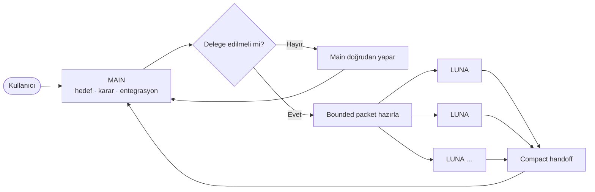

<div align="center">

# ⚡ AgentMaxxing

### Ana ajanı keskin tut. Ağır işi dışarı aktar.

**Codex tarzı coding workflow'lar için context-efficient delegasyon.**

[](LICENSE)


[English](README.md) · [Türkçe](README_TR.md)

</div>

---

AgentMaxxing tek bir kural etrafında kurulmuş hafif bir orchestration skill'idir:

> **Ana ajan hedefi, kararları ve entegrasyon context'ini tutar. Ağır ve sınırları belli işler LUNA worker'lara gider.**

Worker'lar küçük ve açık task packet'ları alır, kısa ve doğrulanabilir sonuçlar döndürür. AgentMaxxing'in amacı ajan sayısını artırmak değil, yinelenen context'i azaltmaktır.

## Ana model



Sabit bir worker limiti yoktur. Yeni worker yalnızca işi gerçekten bağımsızsa ve kazandırdığı context, koordinasyon maliyetinden yüksekse açılır.

## Routing

| İş | Varsayılan rota |
| --- | --- |
| Küçük veya sıkı bağlı task | Main doğrudan yapar |
| Tek ağır ve bounded task | Tek LUNA worker |
| Bağımsız ağır iş akışları | Birden fazla LUNA worker |
| Sıralı bağımlılıklar | İlk sonucu bitirip özetledikten sonra sıradakine geç |
| Güvenlik hassas veya yüksek riskli review | Yalnızca gerekçeliyse bağımsız reviewer ekle |

Çakışan dosya sahipliğinden, tekrarlanan repo keşfinden ve somut gerekçe olmadan worker'a bütün konuşmayı vermekten kaçın.

## Sorumluluklar

### Main agent

Main agent şunların sahibidir:

- kullanıcı amacı ve kısıtları;
- mimari kararlar;
- task decomposition ve worker ownership;
- çakışma tespiti;
- final entegrasyon ve doğrulama;
- final cevap.

### LUNA worker

Bir LUNA worker tek bir bounded sonucun sahibidir. Şunları yapmalıdır:

1. yalnızca gerekli girdileri incelemek;
2. işi verilen scope içinde tamamlamak;
3. ilgili doğrulamaları çalıştırmak;
4. bir kez self-review yapıp gerekirse hedefli düzeltme uygulamak;
5. compact handoff döndürmek.

Mümkün olduğunda önerilen profil:

```text
model: gpt-5.6-luna
reasoning: xhigh
```

## Worker packet

Delegasyondan önce belirsizliği kaldır. Kullanışlı bir packet şu şekildedir:

```markdown
Role: LUNA worker

Goal:
<tek ve somut sonuç>

Why delegated:
<izole kalması gereken ağır context veya iş yükü>

Inputs:
- <tam dosya, klasör, log, komut, URL veya artefact>

Scope:
- May inspect: <...>
- May edit: <...>
- Must not edit: <...>

Suggested steps:
1. <ilk faydalı adım>
2. <doğrulama ve self-review>

Constraints:
- <davranış, API, dependency, stil veya izin sınırı>

Done when:
- <ölçülebilir kabul kriteri>

Validation:
- <tam komut veya kontrol>

Return only:
- status
- changed files
- 2–5 result bullets
- validation result
- material caveat or decision needed
```

Edge case'ler için [worker packet rehberine](.agents/skills/agentmaxxing/references/worker-packet.md) ve [routing rehberine](.agents/skills/agentmaxxing/references/routing.md) bakabilirsin.

## Compact handoff

Worker transcript değil, entegrasyon indeksi döndürmelidir:

```text
STATUS: success | needs-input | failed

CHANGED:
- <paths or none>

RESULT:
- <2–5 kısa madde>

VALIDATION:
- PASS/FAIL/SKIPPED — <tam komut veya kontrol>

CAVEAT / DECISION NEEDED:
- <yalnızca önemliyse>
```

Main agent yalnızca entegrasyon için gereken diff veya artefact'ları açar.

## Kurulum

Repo-scoped skill şu konumdadır:

```text
.agents/skills/agentmaxxing/
```

Codex skill installer ile kur veya bu klasörü desteklenen bir skills konumuna kopyala. Açıkça çağır:

```text
$agentmaxxing <repo görevin>
```

Implicit invocation kapalıdır; böylece küçük normal işler workflow'u istemeden değiştirmez.

## Repo yapısı

```text
AgentMaxxing/
├── .agents/skills/agentmaxxing/
│   ├── SKILL.md
│   ├── agents/openai.yaml
│   └── references/
│       ├── routing.md
│       └── worker-packet.md
├── docs/ARCHITECTURE.md
├── AGENTS.md
├── CHANGELOG.md
├── README.md
└── README_TR.md
```

AgentMaxxing bir runtime değil, instruction layer'dır. Daemon, database, telemetry servisi, token ledger veya persistent task registry içermez.

## VisionOffload

VisionOffload şimdilik bilerek dahil edilmedi. Ayrı geliştirilecek ve daha sonra aynı context-isolation prensiplerini kullanabilecek.

## Lisans

Apache License 2.0. AgentMaxxing bağımsız bir açık kaynak projesidir; OpenAI ile bağlantılı veya OpenAI tarafından onaylanmış değildir.
