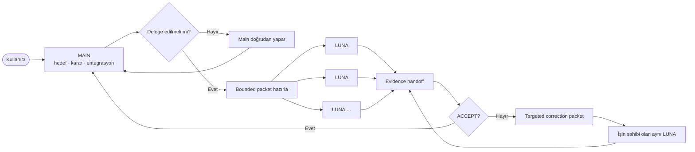

<div align="center">

# ⚡ AgentMaxxing

### Ana ajanı keskin tut. Ağır işi dışarı aktar.

**Codex tarzı coding workflow'lar için context-efficient delegasyon.**

[](LICENSE)


[English](README.md) · [Türkçe](README_TR.md)

</div>

---

AgentMaxxing tek bir kural etrafında kurulmuş hafif bir orchestration skill'idir:

> **Ana ajan hedefi, kararları, kabul sürecini ve entegrasyon context'ini tutar. Ağır ve sınırları belli işler LUNA worker'lara gider.**

Worker'lar küçük ve açık task packet'ları alır, kısa ve doğrulanabilir sonuçlar döndürür. AgentMaxxing'in amacı ajan sayısını artırmak değil, yinelenen context'i azaltmaktır.

## Ana model


```mermaid
flowchart LR
    U([Kullanıcı]) --> M["MAIN<br/>hedef · karar · entegrasyon"]
    M --> R{"Delege edilmeli mi?"}
    R -- Hayır --> D[Main doğrudan yapar]
    R -- Evet --> P[Bounded packet hazırla]
    P --> W1[LUNA]
    P --> W2[LUNA]
    P --> WN["LUNA …"]
    W1 --> H[Evidence handoff]
    W2 --> H
    WN --> H
    H --> G{"ACCEPT?"}
    G -- Evet --> M
    G -- Hayır --> C[Targeted correction packet]
    C --> OW[İşin sahibi olan aynı LUNA]
    OW --> H
    D --> M
```

Sabit bir worker limiti yoktur. Yeni worker yalnızca işi gerçekten bağımsızsa ve kazandırdığı context, koordinasyon maliyetinden yüksekse açılır.

Worker'ın işi bitirmesi otomatik kabul değildir. Main agent önkoşul aşamasını açıkça kabul etmeden bağımlı sonraki aşama başlayamaz.

## Routing

| İş | Varsayılan rota |
| --- | --- |
| Küçük veya sıkı bağlı task | Main doğrudan yapar |
| Tek ağır ve bounded task | Tek LUNA worker |
| Bağımsız ağır iş akışları | Birden fazla LUNA worker |
| Sıralı bağımlılıklar | Önkoşul aşamasını kabul etmeden sıradakine geçme |
| Güvenlik hassas veya yüksek riskli review | Yalnızca gerekçeliyse bağımsız reviewer ekle |

Çakışan dosya sahipliğinden, tekrarlanan repo keşfinden ve somut gerekçe olmadan worker'a bütün konuşmayı vermekten kaçın.

## Sorumluluklar

### Main agent

Main agent şunların sahibidir:

- kullanıcı amacı ve kısıtları;
- mimari kararlar;
- task decomposition ve worker ownership;
- çakışma tespiti;
- final entegrasyon ve doğrulama;
- delege edilen aşamalar için açık `ACCEPT` veya `REJECT` kararı;
- final cevap.

### LUNA worker

Bir LUNA worker tek bir bounded sonucun sahibidir. Şunları yapmalıdır:

1. yalnızca gerekli girdileri incelemek;
2. işi verilen scope içinde tamamlamak;
3. ilgili doğrulamaları çalıştırmak;
4. self-review yapıp bulduğu bütün önemli sorunları düzeltmek;
5. her kabul kriterini kısa kanıtla eşlemek;
6. compact handoff ile `ready-for-review` dönmek.

Mümkün olduğunda reasoning profili:

```text
model: gpt-5.6-luna
reasoning: xhigh | max
```

Stabil interface'lere ve doğrudan validation'a sahip bounded işlerde **xhigh** kullan. Birden fazla sistemi etkileyen implementation, architecture-heavy işler, UI/input/render etkileşimi, nondeterministic hata ve pahalı regression riskinde **max** kullan. xhigh aynı önemli gereksinimi tekrar tekrar kaçırırsa görevi yeniden çerçevele veya gerçek sınırlardan böl; yalnızca gerekli correction context'ini fresh bir max worker'a ver.

## Worker packet

Delegasyondan önce belirsizliği kaldır. Kullanışlı bir packet şu şekildedir:

```markdown
Role: LUNA worker

Reasoning:
xhigh | max

Goal:
<tek ve somut sonuç>

Why delegated:
<izole kalması gereken ağır context veya iş yükü>

Inputs:
- <tam dosya, klasör, log, komut, URL veya artefact>

Scope:
- May inspect: <...>
- May edit: <...>
- Must not edit: <...>

Suggested steps:
1. <ilk faydalı adım>
2. <doğrulama ve self-review>

Constraints:
- <davranış, API, dependency, stil veya izin sınırı>

Done when:
- A1 — <ölçülebilir kabul kriteri>
- A2 — <ölçülebilir kabul kriteri>

Critical review surfaces:
- <main'in kontrol edeceği integration boundary, riskli davranış veya artefact>

Validation:
- <tam komut veya kontrol>

Return only:
- status
- changed files
- 2–5 result bullets
- her kriter için acceptance evidence
- validation result
- self-review result
- material caveat or decision needed
```

Edge case'ler için [worker packet rehberine](.agents/skills/agentmaxxing/references/worker-packet.md) ve [routing rehberine](.agents/skills/agentmaxxing/references/routing.md) bakabilirsin.

## Compact handoff

Worker transcript değil, entegrasyon indeksi döndürmelidir:

```text
STATUS: ready-for-review | needs-input | failed

CHANGED:
- <paths or none>

RESULT:
- <2–5 kısa madde>

ACCEPTANCE:
- A1 PASS/FAIL — <kısa kanıt>
- A2 PASS/FAIL — <kısa kanıt>

VALIDATION:
- PASS/FAIL/SKIPPED — <tam komut veya kontrol>

SELF-REVIEW:
- <düzeltilen önemli sorun veya none>

CAVEAT / DECISION NEEDED:
- <yalnızca önemliyse>
```

Main agent yalnızca entegrasyon için gereken diff veya artefact'ları açar.

## Kabul ve düzeltme

Main agent karar vermek için changed path listesini, acceptance evidence'ı, zorunlu validation'ı, önceden belirtilen kritik yüzeyleri ve yalnızca entegrasyon açısından hassas diff veya artefact'ları kontrol eder.

- Bütün zorunlu kriterlerin güvenilir kanıtı varsa ve önemli sorun es geçilmiyorsa **ACCEPT**.
- Kanıt eksikse, validation yetersizse, scope dışına çıkılmışsa veya önemli kusur kalmışsa **REJECT**.

Red durumunda main agent; başarısız acceptance ID'lerini, gözlenen kanıtı, korunacak çalışan davranışı, correction scope'u ve tam recheck'i aynı LUNA worker'a gönderir. LUNA bir delta handoff döndürür ve main agent yeniden karar verir. Kabul edilene veya gerçek bir authorization, kullanıcı kararı ya da external-state engeline ulaşılana kadar döngü sürer. Main agent kriteri es geçmez, reddedilen delegated implementation'ı sessizce kendisi düzeltmez ve bağımlı aşamayı açmaz.

## Kurulum

Repo-scoped skill şu konumdadır:

```text
.agents/skills/agentmaxxing/
```

Codex skill installer ile kur veya bu klasörü desteklenen bir skills konumuna kopyala. Açıkça çağır:

```text
$agentmaxxing <repo görevin>
```

Implicit invocation kapalıdır; böylece küçük normal işler workflow'u istemeden değiştirmez.

## Repo yapısı

```text
AgentMaxxing/
├── .agents/skills/agentmaxxing/
│   ├── SKILL.md
│   ├── agents/openai.yaml
│   └── references/
│       ├── routing.md
│       └── worker-packet.md
├── docs/ARCHITECTURE.md
├── AGENTS.md
├── CHANGELOG.md
├── README.md
└── README_TR.md
```

AgentMaxxing bir runtime değil, instruction layer'dır. Daemon, database, telemetry servisi, token ledger veya persistent task registry içermez.

## VisionOffload

VisionOffload şimdilik bilerek dahil edilmedi. Ayrı geliştirilecek ve daha sonra aynı context-isolation prensiplerini kullanabilecek.

## Lisans

Apache License 2.0. AgentMaxxing bağımsız bir açık kaynak projesidir; OpenAI ile bağlantılı veya OpenAI tarafından onaylanmış değildir.
