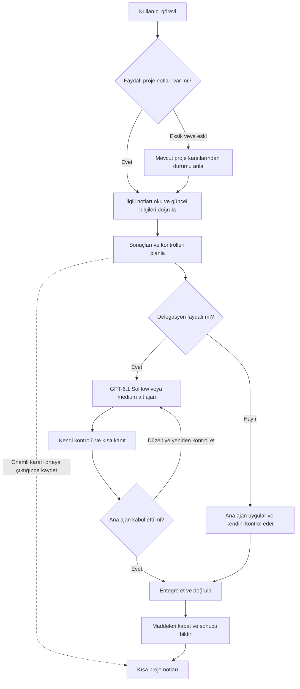

<div align="center">

# ⚡ AgentMaxxing

**Odaklı uygulama. Faydalı delegasyon. Kalıcı proje yönü.**

**Tek ajanla çalışma**, isteğe bağlı **GPT-6.1 Sol low/medium alt ajanları** ve **kısa proje hafızası** için hafif bir Codex skill'i.

[](LICENSE)


[English](README.md) · [Türkçe](README_TR.md)

[Başlangıç](#hızlı-başlangıç) · [İş akışı](#çalışma-akışı) · [İlk kullanım](#projeye-ortadan-katılma) · [Alt ajanlar](#alt-ajan-seçimi) · [Hafıza](#küçük-hafıza-korunan-bilgi)

</div>

---

> **İşi odaklı, kararları kalıcı tut.** Varsayılan olarak tek ajanla çalış, fayda sağlayan sınırlı işleri delege et ve gelecek işleri sohbet geçmişinde kaybolmadan kaydet.

| Uygulama | Alt ajanlar | Süreklilik |
| --- | --- | --- |
| **Tek entegrasyon sahibi** | **GPT-6.1 Sol low veya medium** | **Kısa, kaynaklı Markdown notları** |
| Aşamaları otomatik alt ajan açmadan planla | Seviyeyi göreve uyarla; üst sınır medium | Amaç, koşul ve kanıtı oturumlar arasında koru |

## Hızlı başlangıç

Skill'i kurmak için Codex'e şu isteği ver:

```text
Use $skill-installer to install the skill at:
https://github.com/HakanBabus/AgentMaxxing/tree/main/.agents/skills/agentmaxxing
```

`.agents/skills/agentmaxxing/` klasörünü desteklenen bir skills konumuna kopyalayabilir veya repo kapsamındaki sürümü kullanabilirsin. Skill kendi referanslarını içerir; proje hafızası çalıştığın projenin içinde kalır.

Ardından açıkça çağır:

```text
$agentmaxxing Kaydetme/yeniden yükleme hatasını düzelt. Kapsamı koru ve doğrula.
```

Projenin ortasında mısın? Aynı çağrıyı kullan. **Önceden AgentMaxxing notları bulunması gerekmiyor.** Skill önce mevcut dosya ve belgelerden durumu anlar.

Ana oturum, seçtiğin model ve reasoning seviyesini korur. İsteğe bağlı alt ajanlar `gpt-6.1-sol` ile `low` veya `medium` kullanır. Otomatik skill çağırma kapalı kalır. Yerel keşif ve çağırma davranışı için [resmî skills rehberine](https://learn.chatgpt.com/docs/build-skills) bak.

## Çalışma akışı


```mermaid
flowchart TD
    A[Kullanıcı görevi] --> B{Faydalı proje notları var mı?}
    B -->|Evet| C[İlgili notları oku ve güncel bilgileri doğrula]
    B -->|Eksik veya eski| D[Mevcut proje kanıtlarından durumu anla]
    D --> C
    C --> E[Sonuçları ve kontrolleri planla]
    E --> F{Delegasyon faydalı mı?}
    F -->|Hayır| G[Ana ajan uygular ve kendini kontrol eder]
    F -->|Evet| H[GPT-6.1 Sol low veya medium alt ajan]
    H --> I[Kendi kontrolü ve kısa kanıt]
    I --> J{Ana ajan kabul etti mi?}
    J -->|Düzelt ve yeniden kontrol et| H
    J -->|Evet| K[Entegre et ve doğrula]
    G --> K
    K --> L[Maddeleri kapat ve sonucu bildir]
    E -. Önemli kararı ortaya çıktığında kaydet .-> M[Kısa proje notları]
    L --> M
```

| Adım | Ne yapılır? |
| --- | --- |
| **Durumu anla** | Mevcut projeyi ve istenen kapsamı belirle |
| **Uygula** | Doğrudan çalış veya faydalı bir bağımsız görevi izole et |
| **Doğrula** | Kendi işini incele, doğrula ve bağımlı işlerden önce kanıtı kabul et |
| **Hatırla** | Çalışırken kararları kaydet; bitişte maddeleri kapat veya ertele |

Büyük bir görev, aşamalar boyunca tek ajanla ilerleyebilir. Delegasyon ayrı bir karardır. Entegrasyon ve ortak hafıza yazımı boyunca ana ajan sorumludur.

## Projeye ortadan katılma

**Eksik hafıza, projeyi yeniden başlatmayı değil mevcut durumu anlamayı gerektirir.** AgentMaxxing; geçerli talimatları, özet/README'yi, ilgili manifest veya giriş noktalarını, mevcut planları ve devam eden işi inceler. Kaynak incelemesini yalnızca görevin ihtiyaç duyduğu kanıt için genişletir.

| Projede bulunan bilgi | Nasıl ele alınır? |
| --- | --- |
| Mevcut yol haritası veya sürüm kontrol listesi | Asıl belge olarak korunur ve bağlantı verilir |
| Commit edilmemiş değişiklikler | Devam eden iş olarak korunur; tamamlanmışlığı doğrulanmamıştır |
| Eski TODO veya planlar | Kaynağı tutulur; kontrol edilene kadar durumu doğrulanmamış kalır |
| Eksik geçmiş veya sürüm hedefi | Bilinmiyor olarak kalır; zaman çizelgesi veya sürüm uydurulmaz |
| Kısmi veya eski notlar | İlgili eksikler tamamlanır, mevcut durum aşamalı olarak uzlaştırılır |
| Salt okunur istek | Dosya oluşturulmadan veya değiştirilmeden not önerisi döndürülür |

İlk özet **kısa ve kanıta dayalıdır**. Yol haritası, sürüm ve geçmiş dosyaları yalnızca saklanacak faydalı bilgi varsa oluşur. Git varsa kullanışlıdır; Git olmayan proje de mevcut dosya ve belgelerinden anlaşılabilir. Monorepo'da çalışılan bileşenin kapsamı açık tutulur.

Örneğin kaydetme değişiklikleri tamamlanmamış bir editör, devam eden editör işidir. Daha sonra export ekleme isteği gelecek iş olarak kaydedilir; şimdi export uygulama iznine dönüşmez. Bilinmeyen geçmiş, kapsamı net mevcut bir düzeltmeyi durdurmamalıdır.

[İlk kullanım protokolüne](.agents/skills/agentmaxxing/references/project-memory.md#first-use-in-an-existing-project) bak.

## Alt ajan seçimi

**Küçük görev, zorunlu delegasyon demek değildir.** Net bir görev bağımsız ilerleyebiliyor veya ağır ara bağlamı izole ediyorsa low alt ajan faydalıdır. Gerekli bağlam zaten ana ajandaysa doğrudan uygulama tercih edilir.

| Yol | Uygun olduğu durum | Örnek |
| --- | --- | --- |
| **Ana ajan** | Mevcut bağlam veya sıkı bağlı kararlar | Ana ajanın zaten anladığı yerel düzeltme |
| **GPT-6.1 Sol low** | Küçük kapsam, stabil girdiler, doğrudan doğrulama | Odaklı arama, belge düzenlemesi veya bilinen hatanın düzeltmesi |
| **GPT-6.1 Sol medium** | Daha kapsamlı sınırlı iş veya etkileşen gereksinimler | Dosyalar arası teşhis veya bir migration adımı |
| **Salt okunur reviewer** | Somut risk veya kanıt eksikliği | Kabul edilmiş aşamalar arasındaki kurtarma davranışını doğrulama |

- Desteklenen başlatma kontrollerinde **`gpt-6.1-sol`** ve **`low` veya `medium`** seviyesini açıkça seç.
- Araştırma, reviewer ve düzeltme denemeleri dahil **üst sınır medium**.
- Low zorlanırsa paketi iyileştir ve gerekçesi varsa medium kullan. Medium zorlanırsa görevi daralt, kanıtı iyileştir veya sıkı bağlı kararı ana ajana geri getir.
- Alt ajan sayısını gerçek bağımsızlık ve istemci sınırları belirler. Eşzamanlı yazarların kapsamı çakışmamalıdır; ortak hafızaya ana ajan yazar.
- Profil mevcut değilse ana ajan mümkün olduğunda doğrudan devam eder ve sınırlamayı belirtir. Başka bir alt ajan modeli sessizce seçilmez.

GPT-6.1 Sol bu seviyeleri [resmî model belgesinde](https://developers.openai.com/api/docs/models/gpt-6.1-sol) destekler. Yönlendirme politikası bu projenin tercihidir. Amaç gereksiz bağlamı ve koordinasyonu azaltmaktır; genel bir maliyet veya kalite üstünlüğü vaat edilmez.

## Küçük hafıza, korunan bilgi

**Notu kısa tut; anlamı koru.** Bu dosyaları oluşturmadan önce mevcut proje belgelerini kullan:

```text
.agentmaxxing/
├── project.md   Mevcut yön, kısıtlar ve kaynak bağlantıları
├── roadmap.md   Gelecek hâl, fikirler, kabul edilen işler ve ertelemeler
├── release.md   Sürüm kontrolleri, uyumluluk koşulları ve kanıt
└── history.md   Önemli dönüm noktaları ve karar gerekçeleri
```

Yalnızca faydalı dosyaları oluştur. Özet bir indekstir; tüm mimarinin kopyası değildir. Her görevde geçmişin tamamını yüklemek yerine ilgili bölümleri gerektiğinde oku.

Kısa bir kayıt, önemli bilgiyi tek maddede taşıyabilir:

```text
R-07 [deferred] Çevrimdışı export | storage v2 doğrulamasından sonra
Kaynak: 2026-10-02, kullanıcı isteği | Kontrol: export verisi yeniden yüklemede korunur
```

| Korunacak bilgi | Nasıl kısa tutulur? |
| --- | --- |
| Sonuç, durum ve kimin istediği | Tek kaynaklı kayıt; tekrarlanan paragraflar yok |
| Kısıtlar, bağımlılıklar ve anlamlı gerekçe | Kısa koşullar ve tam ayrıntıya bağlantı |
| Açık sorular ve sürüm yükümlülükleri | Açıkça çözülmemiş maddeler ve kanıtlı kontrol kutuları |
| Önemli eski ayrıntılar | Gerektiğinde bağlantılı arşiv ve kullanışlı indeks |

**Aynı turda kaydet:** "sonra," "release'ten önce" ve "şu olana kadar ertele" istekleri, ajan çalışırken kalıcı nota dönüşmelidir. Öneriler `idea` olarak kalır; kabul edilmiş veya ertelenmiş işlerin koşulları korunur. Keyfî uzunluk sınırına uymak için özgün bilgiyi silme.

**Kanıttan devam et:** değişebilir bilgileri doğrula, geçersizleşen notları güncelle ve kullanıcı amacını koru. Eksik veya eski not, tahmin yürütme ya da durma gerekçesi değil, aşamalı onarım gerektirir.

**Sürümden önce kontrol et:** hazır olma iddiası gerçek doğrulama ister. Başarısız veya yapılamayan kontroller görünür kalır. Hafıza kaydı aktif çalışma sırasında gerçekleşir; arka plan servisi veya ani kesinti sonrası garantili kayıt yoktur.

[Hafıza protokolüne](.agents/skills/agentmaxxing/references/project-memory.md) ve [bu reponun kısa notlarına](.agentmaxxing/project.md) bak.

## Kanıt ve düzeltmeler

Alt ajan küçük bir paket alır: **model/seviye, sonuç, delegasyon gerekçesi, tam girdiler, yazma kapsamı, bağımlılıklar, kabul ve doğrulama**. `ready-for-review` dönmeden önce test eder ve kendi işini gözden geçirir.

Ana ajan **ACCEPT** veya **REJECT** kararı için gerekeni inceler. Bağımlı iş kabulü bekler. Düzeltme alt ajanda kalabilir veya açık yazma sahipliği devriyle ana ajana geçebilir; iki yol da yeniden kontrol gerektirir.

<details>
<summary><strong>Kısa sonuç devri biçimi</strong></summary>

```text
STATUS: ready-for-review | needs-input | failed
CHANGED: <dosyalar veya none>
RESULT: <kısa sonuç>
ACCEPTANCE: <kriter ID'leri, PASS/FAIL, kanıt>
VALIDATION: <PASS/FAIL/SKIPPED, tam kontrol>
SELF-REVIEW: <önemli düzeltme veya none>
MEMORY NOTES: <ana ajan için kalıcı notlar veya none>
CAVEAT: <yalnızca önemliyse>
```

Kanıt ve ilgili çıktılara yönlendirme döndür; ham logları ve tam konuşma dökümlerini ana bağlamın dışında tut. [Low/medium görev paketi örneklerine](.agents/skills/agentmaxxing/references/worker-packet.md) bak.

</details>

## Skill yapısı

```text
.agents/skills/agentmaxxing/
├── SKILL.md
├── agents/openai.yaml
└── references/
    ├── routing.md
    ├── worker-packet.md
    └── project-memory.md
```

| Belge | Ne için okunur? |
| --- | --- |
| [Skill](.agents/skills/agentmaxxing/SKILL.md) | Uygulama talimatları |
| [Yönlendirme](.agents/skills/agentmaxxing/references/routing.md) | Reasoning, eşzamanlılık, reviewer ve düzeltmeler |
| [Görev paketleri](.agents/skills/agentmaxxing/references/worker-packet.md) | Sınırlı görev örnekleri |
| [Proje hafızası](.agents/skills/agentmaxxing/references/project-memory.md) | İlk kullanım, kısa kayıt, devam ve sürüm |
| [Mimari](docs/ARCHITECTURE.md) | Roller, yaşam döngüsü ve hata yönetimi |
| [Değişiklik günlüğü](CHANGELOG.md) · [Katkı rehberi](CONTRIBUTING.md) | Değişiklikler ve katkı kapsamı |

## Kapsam ve lisans

AgentMaxxing birkaç yerel Markdown notuyla çalışan bir talimat katmanı olarak kalır. Veritabanı, daemon, dashboard, telemetri, token defteri veya alt ajan kaydı eklemez. Ana oturum ayarlarını ve kullanıcının yetki sınırlarını korur. VisionOffload bu revizyonun dışındadır.

[Apache License 2.0](LICENSE). Bağımsız açık kaynak projesi; OpenAI ile bağlantılı veya OpenAI tarafından onaylanmış değildir.
