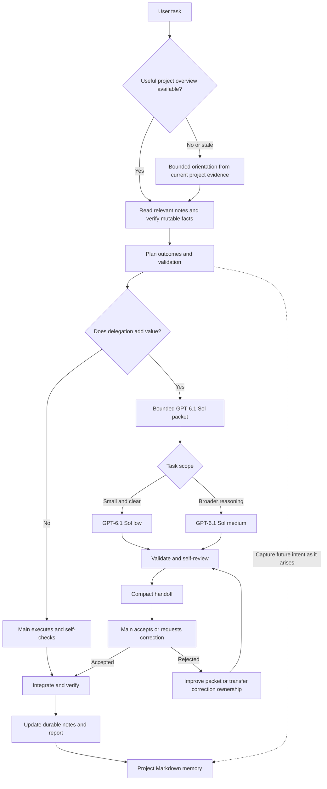

# Architecture

AgentMaxxing is an instruction layer for focused coding work and durable project intent.

## Objective

Produce verified results while reducing unnecessary context, duplicated investigation, and coordination. Use one integration owner and direct execution by default. Preserve future work and release obligations across sessions.

## Execution model



### Main agent

Owns user intent, planning, direct execution, integration, acceptance, and project-memory writes. Its model and reasoning effort remain those selected by the user; the skill does not reconfigure the main session.

### Optional GPT-6.1 Sol worker

Owns a bounded delegated outcome. All workers, including researchers and reviewers, use `gpt-6.1-sol`. Low is for small tasks with clear inputs and direct checks; medium is for broader implementation, diagnosis, and cross-component reasoning. Medium is the ceiling on every worker attempt.

Select the profile through supported spawn controls. A role label does not enforce a model. If the profile is unavailable, main can continue directly when feasible and disclose the limitation. Do not silently substitute a worker model.

### Stages and ownership

Compound work can use dependency-aware milestones while remaining with one agent. Delegation is a separate optimization. Concurrent workers require independent outcomes and non-overlapping write scopes; the client's limits constrain actual concurrency. AgentMaxxing adds no fixed worker cap.

Keep transient stage and worker state in working context. Durable roadmap commitments belong in project memory. These are distinct lifecycles.

### Validation and acceptance

The implementing agent validates and self-reviews. A worker returns concise acceptance evidence and `ready-for-review`. Main examines integration-sensitive artifacts and issues `ACCEPT` or `REJECT` before dependent execution.

Corrections normally stay with a worker whose context remains useful. Main may take over after explicitly transferring write ownership. Both routes require rechecking and acceptance. At medium, difficulty is addressed through a smaller scope, better evidence, or a main-owned decision; the effort ceiling and quality standard remain intact.

Independent review is optional, based on concrete risk, an evidence gap, or user request. A broad task does not mechanically spawn a reviewer.

## Project memory

Reuse existing authoritative documents. Where equivalents are missing, use this small project-local tree:

```text
.agentmaxxing/
├── project.md   # Current direction, constraints, and document links
├── roadmap.md   # Future shape, accepted work, deferrals, and ideas
├── release.md   # Release obligations and verified checks
└── history.md   # Meaningful milestones and decision rationale
```

### First use and recovery

Joining an existing project without AgentMaxxing notes starts with a bounded,
read-only orientation: applicable instructions, README/overview, relevant
manifest or entrypoints, existing plans, and current work status. In-progress
changes remain untouched. Git is helpful evidence when available, not a
requirement. Keep monorepo component scope explicit.

Seed only useful missing notes with observed facts and sources. Keep unknown
history, release targets, and unverified old plans labeled; do not invent
commitments or require the user to recount the whole project. Partial memory is
filled incrementally; stale facts are reconciled with current evidence without
discarding durable intent. Continue the authorized task with narrow assumptions,
asking only about conflicts that affect its outcome.

### Compact records without lost intent

Prefer a short record of outcome, status, condition, date, and source. Remove
duplicated prose and link existing details. Preserve unique rationale,
dependencies, unresolved questions, exact acceptance conditions, and release
evidence. Archive bulky older detail with a pointer when necessary; there is no
fixed length budget that justifies deleting useful information.

Read the overview first and load relevant sections on demand. Verify mutable notes against source files. Main records explicit future requests promptly, rather than waiting for a long task to finish. Worker handoffs include candidate memory notes for main to review and merge.

Ideas and accepted work have distinct statuses and sources. Deferral preserves intent without authorizing immediate implementation. A new user decision can supersede an old one. Release checkboxes need evidence; history records milestones rather than every turn or worker action.

Memory is written while the agent is active. There is no background capture process or guaranteed recording after abrupt interruption. Explicit skill invocation and project instruction pointers determine when this discipline applies. Details and examples live in the [memory protocol](../.agents/skills/agentmaxxing/references/project-memory.md).

## Cost and context boundaries

```text
useful delegation = isolated context + independent progress + specific evidence value
coordination cost = repeated inputs + packets + handoffs + review + integration
```

Choose delegation when its benefit is worth that cost. GPT-6.1 Sol low is a scope choice, not a claim that GPT-6.1 Sol tokens are cheap. No universal quality, speed, or cost advantage is asserted.

Keep packets and handoffs small. Load only relevant memory, deduplicate durable notes, and archive old history when it becomes cumbersome. Do not add a token ledger or runtime to estimate an unmeasured saving.

## Failure handling

| Failure | Response |
| --- | --- |
| A future request stays only in chat | Record it in the authoritative roadmap during the same turn |
| An agent suggestion becomes an apparent commitment | Mark it as an idea with its actual source |
| Old notes contradict current implementation | Check source files and update the affected note |
| Every stage gets a worker or reviewer | Require a distinct isolation, progress, or evidence benefit |
| A worker receives an overloaded specification | Narrow the outcome or split at a real dependency |
| Low misses a reasoning requirement | Improve the packet and use medium when justified |
| Medium stalls | Improve evidence, reduce scope, or return the coupled decision to main |
| Two agents edit shared files or memory | Stop the overlap and assign one active writer |
| An unmet criterion is reported complete | Reject, correct, and recheck before dependent work |
| Project memory grows into a transcript | Deduplicate, retain durable decisions, and archive old milestones |

## Boundaries

AgentMaxxing contains no database, daemon, dashboard, telemetry service, persistent worker registry, or orchestration runtime. It does not change account configuration or authorize commits, pushes, or publication. VisionOffload remains outside this revision.
